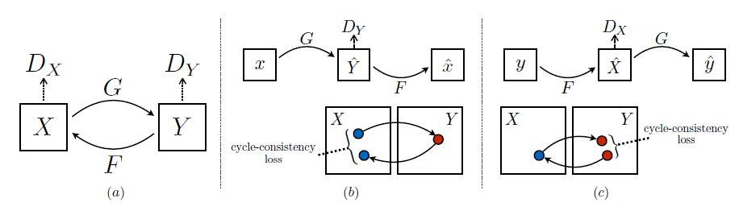
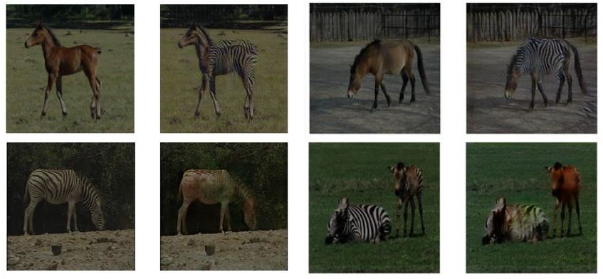
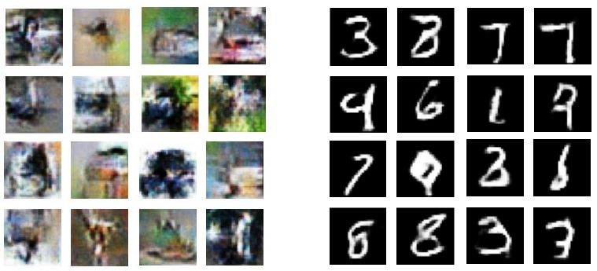

# A-Survey-on-GANs
A survey study on the theory and implementation of GAN models (inclduing Cycle-GAN, WGAN, and StyleGAN).

## CycleGAN:
First introduced in the paper ([Unpaired Image-to-Image Translation Using Cycle-Consistent Adversarial Networks](https://ieeexplore.ieee.org/document/8237506)), this architecture is in fact contained of two sub-GANs: One for image from domain X and one for domain Y.

In the above capture, ($G$, $D_Y$) and ($F$, $D_X$) make up the first and second GANs, respectively. The goal is to transform a sample from domain X (for example, black and white images) to domain Y (RGB images) and vice versa.

In order to do these transitions, we have to take three loss functions into account:

1. Basic and typical loss functions of each sub-module:
$$L_{GAN}(G, D_Y, X, Y) = E_{y \sim p_{data(y)}}[log \space D_Y(y)] + E_{x \sim p_{data(x)}}[log \space (1 - D_Y(G(x)))]$$

$$L_{GAN}(F, D_X, X, Y) = E_{x \sim p_{data(x)}}[log \space D_X(x)] + E_{y \sim p_{data(y)}}[log \space (1 - D_X(F(y)))]$$

2. Cycle Consistency Loss: 
$$L_{cyc}(G, F) = E_{x \sim p_{data(x)}} [|| F(G(x)) - y ||_1 ] + E_{y \sim p_{data(y)}} [|| G(F(y)) - y ||_1 ]$$

Some outputs of my code on the horse2zebra dataset:

## Wasserstein GAN (WGAN):

A GAN structure proposed in [this paper](https://proceedings.mlr.press/v70/arjovsky17a.html), which critizes traditional KL and JS divergences and provides cases where using these metrics yields indifferentiable loss functions. Therefore, the paper introduces Wasserstein loss (finding greatest lower bound):

$$ max_{||f||_L \le 1} E_{x \sim P_r}[f(x)] - E_{x \sim P_{g}}[f(x)] $$

Where $P_r$ and $P_g$ are the distributions of real and generated data, respectively. However, the above formuala has a constraint, stating that f must be 1-Lipshitz. i.e. :

$$\frac {f(x) - f(y)}/{x - y} \le 1$$

The [second paper](https://papers.nips.cc/paper_files/paper/2017/hash/892c3b1c6dccd52936e27cbd0ff683d6-Abstract.html) shows that this constraint causes problems in discriminator loss convergance. Hence, it suggests placing a L2 regularization term at the end of the loss term instead of the constraint. For the exact training algorithm, please refer to the slides.

$$ L = D_w(\tilde{x}) - D_w(x) + \lambda(|| \nabla_{\hat{x}} D_w(\hat{x}) ||_2 - 1)^2 $$

Some outputs generated by WGAN on the CIFAR-10 and MNIST datasets.

## StyleGAN
